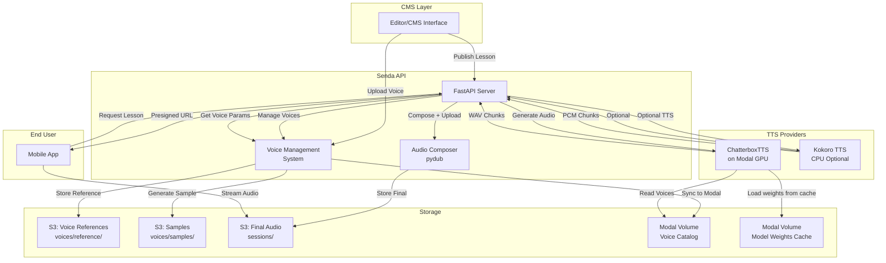
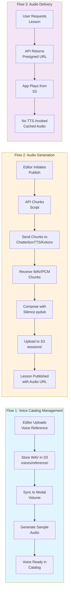
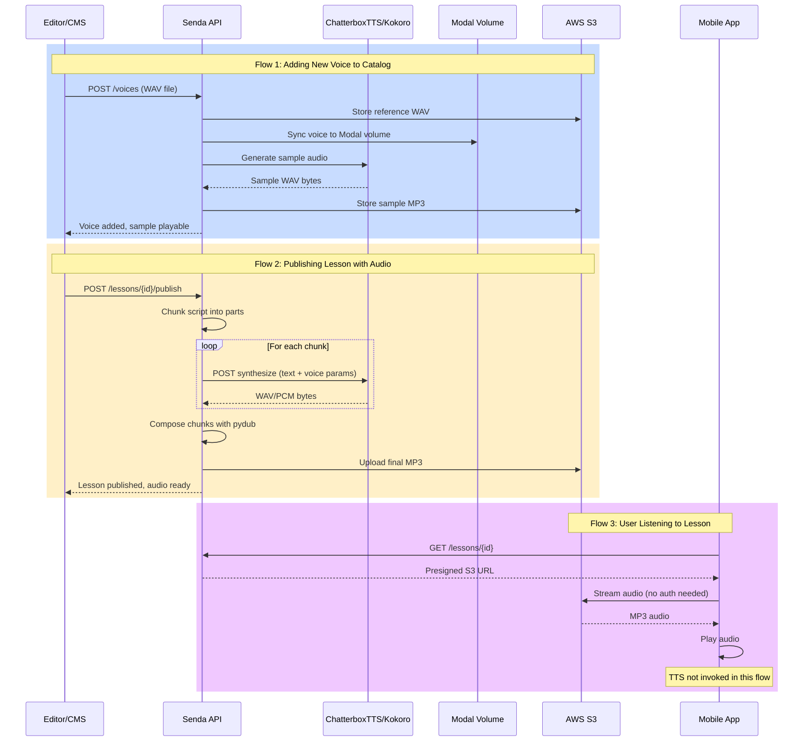

# ChatterboxTTS Architecture & Design

This document explains the architecture, design decisions, and operational flows for integrating ChatterboxTTS audio generation within the Senda platform.

---

## 1. Overview

Senda supports **dual TTS engines**:

- **ChatterboxTTS** (Primary): State-of-the-art neural TTS deployed on **Modal.com** with GPU acceleration
- **Kokoro TTS** (Optional): Local/CPU-based TTS for fallback or development

The architecture is designed to maximize flexibility:

- **GPU-accelerated synthesis** (ChatterboxTTS) with sub-second latency on A10G GPUs
- **Optional CPU fallback** (Kokoro) for development or when GPU is unavailable
- **Customizable voice parameters** for fine-tuning audio output
- **Managed voice catalog** with reference files and sample audio
- **Serverless architecture** with automatic scaling and pay-per-use pricing
- **Isolated infrastructure** kept separate from the end-user application
- **Provider abstraction** allows switching between engines without changing API contracts

---

## 2. System Architecture Overview



---

## 3. Why ChatterboxTTS + Modal (with Kokoro Fallback)?

### Previous Limitations

The prior single-provider approach had constraints:

- **Kokoro CPU-only**: Deployed on CPU-only Oracle Cloud, resulting in ~5× real-time latency
- **Voice hardcoded**: No management system for multiple voices
- **Audio composition manual**: Chunk alignment with silence insertion was complex
- **Poor scalability**: CPU bottleneck during peak course publishing

### Current Solution Benefits

**ChatterboxTTS (Primary Provider):**
- Running on GPU infrastructure (A10G) with generation times 10-20× faster than CPU
- Supporting a managed voice catalog with tunable synthesis parameters
- Providing native API endpoints for voice synchronization and deletion
- Scaling automatically via Modal's serverless platform

**Kokoro TTS (Fallback Provider):**
- Available as optional local/CPU-based fallback
- Useful for development environments
- Can be enabled when Modal is unavailable
- Maintains backward compatibility with existing voice configurations

**Architecture Benefits:**
- Clear provider abstraction (both implement `IAudioProvider`)
- Seamless switching between engines without API changes
- Strict separation between internal TTS operations and public API

---

## 4. Operational Data Flows

The system operates in three distinct data flows:



### Detailed Flow Interactions



---

## 5. Flow Details & Design Decisions

Each operational flow has distinct characteristics:

### Voice Catalog Management (Flow 1)

The voice management workflow allows editors to create and maintain a library of voices. This is a one-time operation per voice:

- **Reference file persistence**: Voice WAV stored in S3 and synced to Modal volume
- **Sample generation**: Each voice gets a sample MP3 for CMS preview
- **Lifecycle**: References persist across deployments via Modal volume

**Key Design Choice:** Voices stored in Modal volume (not fetched on-demand) to eliminate network overhead and enable fast iteration.

### Audio Generation (Flow 2)

When a lesson is published or audio is regenerated, the system coordinates multiple services:

- **Script chunking**: Lesson content divided into speech/pause segments
- **Parallel synthesis**: Chunks sent to ChatterboxTTS or Kokoro (provider abstraction)
- **Local composition**: Chunks combined with pydub, not on remote TTS
- **S3 storage**: Final MP3 cached for future access

**Key Design Choice:** Audio composition happens locally (API) not on Modal, allowing flexible logic and independent scaling.

### Audio Delivery (Flow 3)

User-facing audio serving is entirely decoupled from generation:

- **No TTS involvement**: Only S3 presigned URLs returned to client
- **CDN-ready**: Audio cached and served from edge locations
- **Scalability**: No Modal load during peak listening periods

**Key Design Choice:** Final audio stored in S3 (not streamed from TTS) reduces operational load and enables caching.

---

## 6. Key Design Decisions

### Why Separate Modal from Public API?

**Decision:** Modal endpoints are only accessed by internal API and CMS, never exposed to the public application.

**Rationale:**
- Reduces operational complexity on the public-facing service
- Isolates TTS infrastructure from user traffic patterns
- Simplifies authentication (internal-only Modal token credentials)
- Allows Modal infrastructure changes without affecting public API contracts
- Provides clear separation of concerns between content generation and content delivery

### Why Store Final Audio in S3?

**Decision:** Generated audio is stored in S3 rather than streamed directly to clients.

**Rationale:**
- Decouples audio generation lifecycle from serving lifecycle
- Enables caching and CDN distribution (CloudFront in production)
- Reduces load on Modal infrastructure (no repeated requests for same audio)
- Provides reliable, persistent storage with built-in redundancy
- Simplifies analytics and usage tracking
- Allows serving from edge locations for lower latency

### Voice Reference Files in Modal Volume

**Decision:** Voice reference WAV files are stored in Modal's persistent volume, not fetched on-demand.

**Rationale:**
- Eliminates network transfer overhead during generation
- Enables fast iteration when tweaking voice parameters
- Reference files persist across deployments without re-uploading
- Volume mounts directly into container at runtime
- No additional S3 API calls during the generation process

### Atomic Audio Composition

**Decision:** Audio is composed locally in the API (using pydub), not on Modal.

**Rationale:**
- Keeps Modal focused on single-purpose text-to-speech
- Composes can happen independently at different speeds/concurrency
- Allows flexible composition logic (silence duration, fade effects, etc.) to evolve without Modal changes
- Reduces complexity of Modal infrastructure
- Enables composition to scale independently

### Dual TTS Engine Support

**Decision:** Support both ChatterboxTTS (primary) and Kokoro (fallback) through provider abstraction.

**Rationale:**
- Flexible development environments (CPU vs GPU)
- Graceful fallback if Modal is temporarily unavailable
- Seamless switching without API changes (both implement `IAudioProvider`)
- Backward compatibility with existing configurations
- Future-proof: Can add more providers (e.g., ElevenLabs, AWS Polly) with minimal changes

---

## 7. Data Model


### Voice Catalog

The voice catalog stores metadata about available voices and their synthesis parameters:

- **Identity**: UUID primary key, unique slug identifier
- **Metadata**: Name, gender, language, description
- **Synthesis Parameters**:
  - Exaggeration (0.0–2.0): Controls pitch/speed variation
  - CFG Weight (0.0–1.0): Classifier-free guidance strength
  - Temperature (0.1–1.0): Sampling temperature for variability
- **Storage References**:
  - Reference WAV file location in S3
  - Sample audio location in S3 (for CMS preview)
  - Modal sync status and last error (if any)
- **Lifecycle**: Creation timestamp, last update timestamp, active/inactive flag

### Lesson Audio Association

Lessons reference their generated audio through:

- **Voice Reference**: Foreign key to the voice used for generation
- **S3 Key**: Path to final composed audio file in S3
- **Generation Metadata**: Timestamp of generation, voice parameters at time of generation

This denormalization allows fast lookups without joining multiple tables.

### S3 Organization

Storage is organized by content type:

```
senda-ai/
├── voices/
│   ├── reference/        # Original WAV files (private, API-only access)
│   │   └── {voice_slug}.wav
│   └── samples/          # MP3 preview samples (CMS access via presigned URLs)
│       └── {voice_slug}_sample.mp3
└── sessions/             # Final composed audio (user access via presigned URLs)
    └── {session_id}/
        └── {voice_slug}.mp3
```

Access patterns:
- `voices/reference/`: Private, IAM credentials only
- `voices/samples/`: Presigned URLs valid 1 hour, CMS-only
- `sessions/`: Presigned URLs valid 1 hour for users, or public via CloudFront in production

---

## 8. Authentication & Security

### Modal Token-Based Auth

ChatterboxTTS endpoints use Modal's native token authentication:

- **Token Format**: Modal provides token ID (ak-*) and token secret (as-*)
- **Transport**: Basic HTTP Authorization header with base64-encoded credentials
- **Scope**: Credentials authenticate the entire Senda API service, not individual users
- **Security**: Tokens stored securely in environment variables, never exposed to client

### S3 Access

- **Reference Files**: Accessed with permanent IAM credentials (service account)
- **Sample Audio**: Generated presigned URLs valid for 1 hour (reduces exposure window)
- **Final Audio**: Public URLs or CloudFront distribution (no credentials needed in URL)

### Internal Endpoints

All TTS endpoints (`/synthesize`, `/sync_voice`, `/delete_voice`) require Modal proxy authentication, automatically enforced by Modal's `requires_proxy_auth=True` parameter.

---

## 9. Detailed Operational Workflows

### Publishing a Lesson with Audio

1. **Editor completes lesson content** in CMS
2. **Editor selects a voice** from the voice catalog
3. **Editor clicks "Publish"**
4. **CMS POSTs** to API endpoint with lesson data and voice ID
5. **API retrieves voice parameters** from database
6. **API chunks the script** (using existing composition logic)
7. **API sends chunks to Modal** with voice parameters
8. **Modal returns WAV bytes** for each chunk
9. **API composes chunks** with silence intervals using local audio processing
10. **API uploads composed file** to S3
11. **API updates lesson record** with S3 reference and voice slug
12. **CMS refreshes** and displays inline audio player
13. **API webhook** notifies CMS of success/failure

### Adding a New Voice

1. **Editor opens voice management** in CMS
2. **Editor uploads WAV file** (reference voice sample)
3. **CMS POSTs** to `/voices` endpoint with file
4. **API validates WAV format** and duration
5. **API uploads reference WAV** to `voices/reference/{slug}.wav` in S3
6. **API calls `/sync_voice` on Modal** to copy reference to Modal volume
7. **API generates sample audio** using the new voice (fixed test text)
8. **API uploads sample MP3** to `voices/samples/{slug}_sample.mp3` in S3
9. **API creates Voice record** in database (only if all prior steps succeed)
10. **Voice appears in CMS catalog**, sample is playable

### Serving Audio to End Users

1. **User opens meditation lesson** in app
2. **App fetches lesson** from API
3. **API returns lesson data** including presigned S3 URL to audio
4. **App renders HTML5 audio** element with S3 URL
5. **Audio plays directly from S3** (or CloudFront in production)
6. **Modal never involved** in this flow
7. **No credentials needed** in the URL (presigned or public)

---

## 10. Scaling & Performance

### ChatterboxTTS Scaling

Modal automatically handles scaling through:

- **Concurrent Inputs**: Up to 10 concurrent requests per container (configurable)
- **Auto-Scaling**: Additional containers spin up when concurrency limits are hit
- **Cold Start**: Kept low (~1-2 seconds) by caching the ~2GB model weights in the `chatterbox-tts-weights` Modal Volume, eliminating the download overhead on fresh container startups.
- **GPU Allocation**: A10G GPUs automatically assigned and released per request

### API Scaling

The Senda API can scale independently:

- **Concurrent Audio Composition**: Multiple audio files can be composed in parallel
- **S3 Upload**: Handled asynchronously, doesn't block API response
- **Database Updates**: Async operations, eventual consistency acceptable

### Typical Performance

- **Chunk Generation**: 0.5–2 seconds per chunk (on GPU, depending on length)
- **Audio Composition**: 0.1–1 second per minute of audio (CPU-bound)
- **S3 Upload**: 1–5 seconds depending on file size
- **End-to-End Publish**: 30–120 seconds for typical lesson (multiple chunks)

---

## 11. Cost Optimization

### Modal Pricing

- **Compute**: Pay-per-second for GPU time used
- **Storage**: Persistent volume storage for voice reference files
- **Free Tier**: ~50 GPU-hours per month for testing

### S3 Costs

- **Storage**: Reference files (small), samples (small), final audio (larger)
- **Transfers**: Minimal for internal API operations
- **Requests**: Presigned URLs don't incur per-request charges

### Overall Strategy

- **Voice references**: Uploaded once, reused indefinitely (minimal cost)
- **Samples**: Generated once per voice (small computational cost)
- **Final audio**: Generated on-demand at publish time (main cost driver)
- **User serving**: Entirely from S3, no additional TTS cost

---

## 12. Error Handling & Recovery

### Voice creation failures

If `POST /voices` fails during Modal sync, TTS, or S3 upload:
- No catalog row is created (slug remains available for retry)
- API returns an error to the CMS (typically `502` for provider failures, `409` if slug exists)
- Admin retries the same request; Modal and S3 keys for that slug are overwritten idempotently

### Generation Failures

If audio generation fails:
- Request returns error to CMS
- Lesson remains unpublished
- Editor can retry or select different voice
- No partial/corrupt audio in S3

### S3 Upload Failures

If S3 upload fails:
- Audio composition succeeded but upload failed
- Lesson update transaction rolled back
- CMS informed of failure
- Editor can retry publish

---

## 13. Future Enhancements

Potential improvements not in current scope:

- **Audio Caching**: Cache chunks by script hash to avoid re-generating identical segments
- **Streaming Generation**: Stream audio to user while still generating (reduce perceived latency)
- **Voice Cloning**: Allow users to create custom voices from their own voice samples
- **On-Demand Generation**: Generate audio without publishing (live preview in editor)
- **A/B Testing**: Generate multiple voice versions for comparison
- **Localization**: Support languages beyond Spanish/English

---

## 12. Resources & References

- [ChatterboxTTS Modal Deployment Guide](./modal_setup.md) — Setup, troubleshooting, monitoring
- [ChatterboxTTS GitHub](https://github.com/diegoberriosr/ChatterboxTTS)
- [Modal Documentation](https://modal.com/docs)
- [AWS S3 Documentation](https://docs.aws.amazon.com/s3/)
